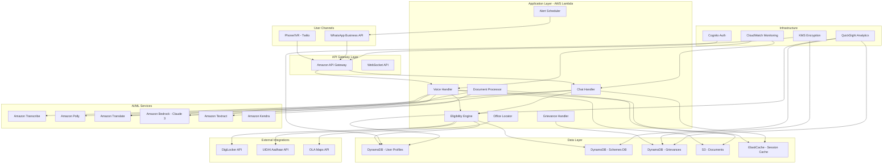

# Design Document: JanSahayak AI

## Overview

JanSahayak AI is a serverless, voice-first, multilingual AI platform designed to connect rural Indian citizens with government welfare schemes. The system architecture prioritizes low-bandwidth operation, voice interaction, and multilingual support to serve users with low literacy on 2G networks.

The platform leverages AWS serverless services for scalability and cost-effectiveness, Amazon Bedrock for AI capabilities, and integrates with government APIs (DigiLocker, UIDAI) and third-party services (WhatsApp Business API, OLA Maps). The design emphasizes data security, DPDP Act 2023 compliance, and 24x7 availability.

## Architecture

### High-Level Architecture



### Architecture Principles

1. **Serverless-First**: All compute runs on AWS Lambda for automatic scaling and cost optimization
2. **Voice-First Design**: Primary interaction mode is voice with text as fallback
3. **Low-Bandwidth Optimization**: All responses compressed and optimized for 2G networks (< 50KB)
4. **Multilingual by Default**: All components support 22 Indian languages
5. **Security and Privacy**: End-to-end encryption, DPDP Act 2023 compliance, minimal data retention
6. **Resilience**: Multi-AZ deployment, automatic failover, graceful degradation
7. **Stateless Services**: Session state in ElastiCache, enabling horizontal scaling

## Components and Interfaces

### 1. Voice Handler (AWS Lambda)

**Purpose**: Processes incoming voice calls via Twilio IVR, orchestrates speech-to-text, AI processing, and text-to-speech.

**Interfaces**:
- **Input**: Twilio webhook with audio stream URL, caller phone number, language preference
- **Output**: TwiML response with audio URL for playback

**Key Functions**:
```typescript
interface VoiceHandler {
  handleIncomingCall(request: TwilioWebhookRequest): Promise<TwiMLResponse>
  processAudioStream(audioUrl: string, language: string): Promise<TranscriptionResult>
  generateVoiceResponse(text: string, language: string): Promise<AudioUrl>
  manageCallState(sessionId: string, state: CallState): Promise<void>
}

interface TwilioWebhookRequest {
  CallSid: string
  From: string
  To: string
  CallStatus: string
  RecordingUrl?: string
  SpeechResult?: string
}

interface TranscriptionResult {
  text: string
  confidence: number
  language: string
  intent: string
}

interface CallState {
  sessionId: string
  userId: string
  currentStep: string
  context: Record<string, any>
  language: string
}
```

**Processing Flow**:
1. Receive Twilio webhook
2. Retrieve or create session from ElastiCache
3. Send audio to Amazon Transcribe for speech-to-text
4. Translate to English if needed (Amazon Translate)
5. Send to AI orchestrator for intent recognition and response generation
6. Translate response back to user's language
7. Convert to speech using Amazon Polly
8. Store audio in S3 with 1-hour expiry
9. Return TwiML with audio URL
10. Update session state in ElastiCache

**Optimization for 2G**:
- Audio compression: Opus codec at 16kbps
- Response chunking: Max 30-second segments
- Adaptive quality: Reduce bitrate if network latency > 3s

### 2. Chat Handler (AWS Lambda)

**Purpose**: Processes WhatsApp messages, handles text and voice notes, manages conversation flow.

**Interfaces**:
- **Input**: WhatsApp Business API webhook with message content
- **Output**: WhatsApp message (text, voice note, or interactive buttons)

**Key Functions**:
```typescript
interface ChatHandler {
  handleIncomingMessage(request: WhatsAppWebhook): Promise<WhatsAppResponse>
  processTextMessage(text: string, userId: string, language: string): Promise<string>
  processVoiceNote(audioUrl: string, userId: string, language: string): Promise<string>
  sendTextResponse(userId: string, text: string): Promise<void>
  sendVoiceNote(userId: string, audioUrl: string): Promise<void>
  sendInteractiveButtons(userId: string, message: string, buttons: Button[]): Promise<void>
}

interface WhatsAppWebhook {
  from: string
  id: string
  timestamp: string
  type: 'text' | 'audio' | 'image' | 'button'
  text?: { body: string }
  audio?: { id: string, mime_type: string }
  image?: { id: string, mime_type: string }
  button?: { text: string, payload: string }
}

interface WhatsAppResponse {
  messaging_product: 'whatsapp'
  to: string
  type: 'text' | 'audio' | 'interactive'
  text?: { body: string }
  audio?: { link: string }
  interactive?: InteractiveMessage
}

interface Button {
  id: string
  title: string
}
```

**Processing Flow**:
1. Receive WhatsApp webhook
2. Authenticate user via phone number
3. Retrieve session from ElastiCache
4. Process message based on type (text/audio/image)
5. For voice notes: transcribe using Amazon Transcribe
6. For images: process with Document Processor
7. Send to AI orchestrator for response
8. Format response for WhatsApp (text or voice note)
9. Send via WhatsApp Business API
10. Update session state

### 3. Eligibility Engine (AWS Lambda)

**Purpose**: Matches user profiles against government scheme eligibility criteria using AI-powered analysis.

**Interfaces**:
- **Input**: User profile data (demographics, income, occupation, family details)
- **Output**: Ranked list of eligible schemes with match scores

**Key Functions**:
```typescript
interface EligibilityEngine {
  matchSchemes(profile: UserProfile): Promise<SchemeMatch[]>
  extractProfileFromVoice(transcript: string): Promise<UserProfile>
  rankSchemes(matches: SchemeMatch[]): SchemeMatch[]
  explainEligibility(scheme: Scheme, profile: UserProfile, language: string): Promise<string>
  checkDocumentRequirements(scheme: Scheme, profile: UserProfile): Promise<DocumentRequirement[]>
}

interface UserProfile {
  userId: string
  aadhaarNumber?: string // encrypted
  name: string
  age: number
  gender: 'male' | 'female' | 'other'
  occupation: string
  annualIncome: number
  landOwnership: number // in acres
  familySize: number
  familyMembers: FamilyMember[]
  state: string
  district: string
  village: string
  category: 'general' | 'obc' | 'sc' | 'st'
  disabilities?: string[]
}

interface FamilyMember {
  name: string
  age: number
  gender: string
  relation: string
  occupation?: string
}

interface Scheme {
  schemeId: string
  name: string
  nameTranslations: Record<string, string> // language code -> translated name
  description: string
  descriptionTranslations: Record<string, string>
  eligibilityCriteria: EligibilityCriteria
  benefits: string
  applicationProcess: ApplicationStep[]
  requiredDocuments: string[]
  deadline?: Date
  state?: string // null for central schemes
  category: 'agriculture' | 'health' | 'housing' | 'employment' | 'education' | 'pension'
}

interface EligibilityCriteria {
  minAge?: number
  maxAge?: number
  gender?: string[]
  occupation?: string[]
  maxIncome?: number
  minLandOwnership?: number
  maxLandOwnership?: number
  category?: string[]
  state?: string[]
  customRules?: string // AI-interpretable rules
}

interface SchemeMatch {
  scheme: Scheme
  matchScore: number // 0-100
  eligibilityStatus: 'eligible' | 'partially_eligible' | 'not_eligible'
  missingCriteria: string[]
  explanation: string
}

interface ApplicationStep {
  stepNumber: number
  description: string
  descriptionTranslations: Record<string, string>
  requiredDocuments: string[]
  officeType: string
  formNumber?: string
}

interface DocumentRequirement {
  documentName: string
  availableInDigiLocker: boolean
  alternativeSource: string
  mandatory: boolean
}
```

**Matching Algorithm**:
1. Load all active schemes from DynamoDB
2. Filter schemes by basic criteria (age, gender, state)
3. For each remaining scheme:
   - Calculate match score based on criteria alignment
   - Use Amazon Bedrock (Claude 3) to interpret complex eligibility rules
   - Identify missing criteria
4. Rank schemes by match score and benefit amount
5. Generate natural language explanations in user's language
6. Return top 10 matches

**AI Prompt for Complex Eligibility**:
```
Given a user profile and scheme eligibility criteria, determine if the user is eligible.

User Profile:
{profile_json}

Scheme Eligibility Criteria:
{criteria_json}

Analyze the eligibility and respond with:
1. Eligible: yes/no/partial
2. Match Score: 0-100
3. Missing Criteria: list of unmet requirements
4. Explanation: simple language explanation

Consider edge cases like:
- Family income vs individual income
- Land ownership thresholds
- Age requirements for different family members
- Category-specific reservations
```

### 4. Document Processor (AWS Lambda)

**Purpose**: Extracts text from government documents using OCR, translates content, and provides simplified explanations.

**Interfaces**:
- **Input**: Image file (JPEG/PNG) from S3 or direct upload
- **Output**: Extracted text, document type, key information, translated content

**Key Functions**:
```typescript
interface DocumentProcessor {
  processDocument(imageUrl: string, userId: string, targetLanguage: string): Promise<DocumentAnalysis>
  extractText(imageUrl: string): Promise<OCRResult>
  identifyDocumentType(text: string): Promise<DocumentType>
  extractKeyInformation(text: string, docType: DocumentType): Promise<KeyInfo>
  translateDocument(text: string, targetLanguage: string): Promise<string>
  generateSimplifiedExplanation(text: string, docType: DocumentType, language: string): Promise<string>
  validateImageQuality(imageUrl: string): Promise<QualityCheck>
}

interface DocumentAnalysis {
  documentType: DocumentType
  originalText: string
  translatedText: string
  keyInformation: KeyInfo
  simplifiedExplanation: string
  actionItems: ActionItem[]
}

interface OCRResult {
  text: string
  confidence: number
  language: string
  blocks: TextBlock[]
}

interface TextBlock {
  text: string
  boundingBox: BoundingBox
  confidence: number
}

interface BoundingBox {
  left: number
  top: number
  width: number
  height: number
}

interface DocumentType {
  type: 'scheme_letter' | 'approval_notice' | 'rejection_notice' | 'payment_receipt' | 'application_form' | 'unknown'
  confidence: number
}

interface KeyInfo {
  schemeReference?: string
  applicationNumber?: string
  deadline?: Date
  amount?: number
  recipientName?: string
  issueDate?: Date
  customFields: Record<string, string>
}

interface ActionItem {
  action: string
  deadline?: Date
  priority: 'high' | 'medium' | 'low'
}

interface QualityCheck {
  isAcceptable: boolean
  issues: string[]
  suggestions: string[]
}
```

**Processing Flow**:
1. Validate image quality (resolution, brightness, blur)
2. If quality is poor, return guidance for retaking photo
3. Send image to Amazon Textract for OCR
4. Detect language using Amazon Comprehend
5. Extract structured data using pattern matching and AI
6. Identify document type using Claude 3
7. Extract key information (dates, amounts, reference numbers)
8. Translate to user's language using Amazon Translate
9. Generate simplified explanation using Claude 3
10. Identify action items and deadlines
11. Store processed document in S3
12. Return analysis to user

**AI Prompt for Document Explanation**:
```
You are explaining a government document to a rural Indian citizen with low literacy.

Document Type: {doc_type}
Original Text: {text}

Provide:
1. Simple Summary: Explain what this document is about in 2-3 simple sentences
2. Key Information: List important details (amounts, dates, reference numbers)
3. Action Required: What should the person do next?
4. Deadline: When must they act by?

Use simple language, short sentences, and avoid technical jargon.
Language: {target_language}
```

### 5. Office Locator (AWS Lambda)

**Purpose**: Finds nearest government offices using GPS coordinates or location name, provides directions.

**Interfaces**:
- **Input**: GPS coordinates or location name
- **Output**: List of nearby offices with details and directions

**Key Functions**:
```typescript
interface OfficeLocator {
  findNearestOffices(location: Location, officeType: string): Promise<Office[]>
  geocodeLocation(locationName: string): Promise<Coordinates>
  getDirections(from: Coordinates, to: Coordinates): Promise<Directions>
  getOfficeDetails(officeId: string): Promise<OfficeDetails>
  updateOfficeDatabase(office: Office): Promise<void>
}

interface Location {
  coordinates?: Coordinates
  locationName?: string
  state: string
  district?: string
}

interface Coordinates {
  latitude: number
  longitude: number
}

interface Office {
  officeId: string
  name: string
  nameTranslations: Record<string, string>
  type: 'jan_seva_kendra' | 'block_office' | 'tehsil_office' | 'district_office' | 'bank' | 'post_office'
  address: string
  coordinates: Coordinates
  contactNumber?: string
  operatingHours: string
  servicesOffered: string[]
  distance?: number // in kilometers
  travelTime?: number // in minutes
}

interface OfficeDetails extends Office {
  holidays: Date[]
  crowdLevel?: 'low' | 'medium' | 'high'
  wheelchairAccessible: boolean
  languagesSpoken: string[]
}

interface Directions {
  distance: number
  duration: number
  steps: DirectionStep[]
  voiceInstructions: string[]
}

interface DirectionStep {
  instruction: string
  distance: number
  duration: number
}
```

**Processing Flow**:
1. If location name provided, geocode using OLA Maps API
2. If GPS coordinates provided, use directly
3. Query DynamoDB for offices within 50km radius
4. Calculate distances using Haversine formula
5. Sort by distance
6. For top 5 offices, fetch detailed information
7. Generate voice-friendly directions using OLA Maps
8. Translate office names and directions to user's language
9. Return ranked list

**Office Database Schema (DynamoDB)**:
```typescript
{
  PK: "OFFICE#{officeId}",
  SK: "METADATA",
  officeId: string,
  name: string,
  type: string,
  state: string,
  district: string,
  coordinates: { lat: number, lon: number },
  address: string,
  contactNumber: string,
  operatingHours: string,
  servicesOffered: string[],
  lastUpdated: string,
  GSI1PK: "STATE#{state}#TYPE#{type}", // for querying by state and type
  GSI1SK: "DISTRICT#{district}"
}
```

### 6. Grievance Handler (AWS Lambda)

**Purpose**: Guides users through filing grievances (RTI, MNREGA disputes), generates formatted documents, tracks status.

**Interfaces**:
- **Input**: Grievance type, user details, issue description (voice or text)
- **Output**: Grievance reference number, formatted document, submission confirmation

**Key Functions**:
```typescript
interface GrievanceHandler {
  initiateGrievance(userId: string, grievanceType: GrievanceType): Promise<GrievanceSession>
  collectGrievanceDetails(sessionId: string, details: GrievanceDetails): Promise<void>
  generateGrievanceDocument(sessionId: string): Promise<Document>
  submitGrievance(sessionId: string): Promise<GrievanceReference>
  checkGrievanceStatus(referenceNumber: string): Promise<GrievanceStatus>
  updateGrievanceStatus(referenceNumber: string, status: string): Promise<void>
}

interface GrievanceType {
  type: 'rti' | 'mnrega_wage' | 'scheme_delay' | 'corruption' | 'other'
  subType?: string
}

interface GrievanceSession {
  sessionId: string
  userId: string
  grievanceType: GrievanceType
  currentStep: number
  collectedData: Record<string, any>
  createdAt: Date
}

interface GrievanceDetails {
  issueDescription: string
  affectedScheme?: string
  officeName?: string
  officialName?: string
  incidentDate?: Date
  supportingDocuments?: string[] // S3 URLs
  expectedResolution: string
}

interface Document {
  documentId: string
  format: 'pdf' | 'text'
  content: string
  s3Url: string
}

interface GrievanceReference {
  referenceNumber: string
  submittedAt: Date
  expectedResolutionDate: Date
  trackingUrl?: string
}

interface GrievanceStatus {
  referenceNumber: string
  status: 'submitted' | 'under_review' | 'resolved' | 'rejected'
  lastUpdated: Date
  resolution?: string
  nextSteps?: string
}
```

**Guided Flow for MNREGA Wage Dispute**:
1. Confirm user worked under MNREGA
2. Collect work period (start date, end date)
3. Collect expected wage amount
4. Collect actual wage received (if any)
5. Collect job card number
6. Collect work site location
7. Record voice description of issue
8. Ask for supporting documents (job card photo, muster roll)
9. Generate formatted complaint
10. Submit to MNREGA portal API (if available) or generate PDF
11. Send confirmation via WhatsApp with reference number

**Grievance Document Template**:
```
GRIEVANCE UNDER MNREGA ACT 2005

Reference Number: {reference_number}
Date: {submission_date}

Complainant Details:
Name: {user_name}
Aadhaar: {aadhaar_masked}
Phone: {phone_number}
Address: {address}

Grievance Details:
Job Card Number: {job_card_number}
Work Period: {start_date} to {end_date}
Work Site: {work_site}
Expected Wage: Rs. {expected_wage}
Wage Received: Rs. {received_wage}
Pending Amount: Rs. {pending_amount}

Description:
{issue_description}

Supporting Documents:
{document_list}

Expected Resolution:
{expected_resolution}

Signature: {digital_signature}
```

### 7. Alert Scheduler (AWS Lambda + EventBridge)

**Purpose**: Sends proactive WhatsApp alerts for scheme deadlines, new schemes, and application reminders.

**Interfaces**:
- **Input**: EventBridge scheduled events, scheme deadline updates
- **Output**: WhatsApp messages to eligible users

**Key Functions**:
```typescript
interface AlertScheduler {
  scheduleDeadlineAlerts(scheme: Scheme): Promise<void>
  sendDeadlineReminder(schemeId: string, daysBeforeDeadline: number): Promise<void>
  notifyNewScheme(scheme: Scheme): Promise<void>
  sendApplicationReminder(userId: string, schemeId: string): Promise<void>
  processAlertQueue(): Promise<void>
  handleOptOut(userId: string): Promise<void>
}

interface Alert {
  alertId: string
  userId: string
  schemeId: string
  alertType: 'deadline_7day' | 'deadline_3day' | 'deadline_1day' | 'new_scheme' | 'application_incomplete'
  scheduledFor: Date
  status: 'pending' | 'sent' | 'failed'
  message: string
  language: string
}
```

**Alert Scheduling Logic**:
1. EventBridge triggers daily at 6 AM IST
2. Query schemes with deadlines in next 7 days
3. For each scheme:
   - Query users eligible for scheme (from eligibility cache)
   - Check if user has opted out
   - Check if alert already sent
   - Create alert records in DynamoDB
4. Process alert queue:
   - Batch alerts by language
   - Translate message templates
   - Send via WhatsApp Business API
   - Update alert status
   - Handle failures with retry logic

**Alert Message Templates**:
```typescript
const alertTemplates = {
  deadline_7day: {
    en: "🔔 Reminder: {scheme_name} application deadline is in 7 days ({deadline_date}). Apply now to avail benefits of Rs. {benefit_amount}. Reply 'APPLY' for guidance.",
    hi: "🔔 अनुस्मारक: {scheme_name} आवेदन की अंतिम तिथि 7 दिनों में है ({deadline_date})। रु. {benefit_amount} का लाभ पाने के लिए अभी आवेदन करें। मार्गदर्शन के लिए 'APPLY' लिखें।"
  },
  new_scheme: {
    en: "🎉 New scheme alert! {scheme_name} is now open. You may be eligible for Rs. {benefit_amount}. Reply 'DETAILS' to learn more.",
    hi: "🎉 नई योजना! {scheme_name} अब खुली है। आप रु. {benefit_amount} के लिए पात्र हो सकते हैं। अधिक जानने के लिए 'DETAILS' लिखें।"
  }
}
```

### 8. AI Orchestrator (Amazon Bedrock - Claude 3 Sonnet)

**Purpose**: Central AI engine for intent recognition, conversation management, response generation, and complex reasoning.

**Key Capabilities**:
- Intent classification from voice/text input
- Multi-turn conversation management
- Scheme eligibility reasoning
- Document interpretation
- Natural language generation in 22 languages (via translation)

**Prompt Engineering Strategy**:

**System Prompt**:
```
You are JanSahayak AI, a helpful assistant for rural Indian citizens seeking government welfare schemes.

Your role:
- Help users discover schemes they're eligible for
- Guide them through application processes
- Explain government documents in simple language
- Answer questions about schemes, offices, and procedures

Guidelines:
- Use simple, clear language
- Be patient and encouraging
- Ask one question at a time
- Confirm understanding before proceeding
- Provide specific, actionable guidance
- Never make promises about scheme approval
- Always mention required documents and deadlines

User Context:
- Low literacy, may not understand technical terms
- Limited digital experience
- May be speaking in regional language (translated to English for you)
- Your responses will be translated back to their language

Current conversation context:
{conversation_history}

User profile:
{user_profile}
```

**Intent Classification Prompt**:
```
Classify the user's intent from their message.

User message: "{user_message}"

Possible intents:
1. discover_schemes - wants to find eligible schemes
2. apply_scheme - wants to apply for a specific scheme
3. check_eligibility - asking if eligible for a scheme
4. read_document - wants help understanding a document
5. find_office - looking for government office location
6. file_grievance - wants to file a complaint
7. check_status - checking application or grievance status
8. general_question - asking about a scheme or process
9. greeting - saying hello or starting conversation
10. help - asking how to use the system

Respond with just the intent name and confidence (0-100).
Format: intent_name|confidence
```

**Response Generation Prompt**:
```
Generate a helpful response for the user.

Intent: {intent}
User message: "{user_message}"
User profile: {user_profile_summary}
Conversation history: {recent_history}

Requirements:
- Keep response under 100 words
- Use simple language (5th grade reading level)
- Be specific and actionable
- If asking for information, ask one question at a time
- If providing information, structure it clearly

Generate response:
```

### 9. Authentication Service (Amazon Cognito + Custom Lambda)

**Purpose**: Authenticates users via phone OTP, manages sessions, integrates with Aadhaar verification.

**Interfaces**:
- **Input**: Phone number, OTP, Aadhaar number
- **Output**: JWT token, user session

**Key Functions**:
```typescript
interface AuthService {
  initiatePhoneAuth(phoneNumber: string): Promise<OTPSession>
  verifyOTP(sessionId: string, otp: string): Promise<AuthToken>
  initiateAadhaarAuth(aadhaarNumber: string): Promise<AadhaarSession>
  verifyAadhaarOTP(sessionId: string, otp: string): Promise<AadhaarData>
  refreshToken(refreshToken: string): Promise<AuthToken>
  logout(userId: string): Promise<void>
}

interface OTPSession {
  sessionId: string
  expiresAt: Date
}

interface AuthToken {
  accessToken: string
  refreshToken: string
  expiresIn: number
  userId: string
}

interface AadhaarSession {
  sessionId: string
  transactionId: string
  expiresAt: Date
}

interface AadhaarData {
  name: string
  dateOfBirth: Date
  gender: string
  address: Address
  photo?: string
}

interface Address {
  house: string
  street: string
  landmark: string
  village: string
  district: string
  state: string
  pincode: string
}
```

**Authentication Flow**:
1. User provides phone number
2. Generate 6-digit OTP
3. Send OTP via SMS (AWS SNS)
4. Store OTP hash in ElastiCache (5-minute expiry)
5. User provides OTP
6. Verify OTP
7. If first-time user, create user record in DynamoDB
8. Generate JWT token using Cognito
9. Store session in ElastiCache (15-minute expiry)
10. Return token to client

**Aadhaar Verification Flow**:
1. User provides Aadhaar number (voice input)
2. Encrypt Aadhaar number using KMS
3. Call UIDAI API to initiate OTP
4. UIDAI sends OTP to Aadhaar-registered mobile
5. User provides OTP
6. Verify OTP with UIDAI
7. Retrieve demographic data
8. Store encrypted Aadhaar in DynamoDB
9. Update user profile with verified data

## Data Models

### User Profile (DynamoDB)

```typescript
{
  PK: "USER#{userId}",
  SK: "PROFILE",
  userId: string,
  phoneNumber: string,
  aadhaarNumber: string, // encrypted with KMS
  name: string,
  age: number,
  gender: string,
  occupation: string,
  annualIncome: number,
  landOwnership: number,
  familyMembers: FamilyMember[],
  address: Address,
  state: string,
  district: string,
  village: string,
  category: string,
  preferredLanguage: string,
  disabilities: string[],
  createdAt: string,
  updatedAt: string,
  lastActiveAt: string,
  alertsEnabled: boolean,
  GSI1PK: "STATE#{state}#DISTRICT#{district}", // for location-based queries
  GSI1SK: "USER#{userId}"
}
```

### Scheme Database (DynamoDB)

```typescript
{
  PK: "SCHEME#{schemeId}",
  SK: "METADATA",
  schemeId: string,
  name: string,
  nameTranslations: Record<string, string>,
  description: string,
  descriptionTranslations: Record<string, string>,
  category: string,
  level: 'central' | 'state',
  state?: string,
  eligibilityCriteria: EligibilityCriteria,
  benefits: string,
  benefitAmount?: number,
  applicationProcess: ApplicationStep[],
  requiredDocuments: string[],
  deadline?: string,
  isActive: boolean,
  createdAt: string,
  updatedAt: string,
  GSI1PK: "CATEGORY#{category}#STATE#{state}", // for category-based queries
  GSI1SK: "DEADLINE#{deadline}"
}
```

### Conversation Session (ElastiCache)

```typescript
{
  sessionId: string,
  userId: string,
  channel: 'phone' | 'whatsapp',
  language: string,
  startedAt: Date,
  lastActivityAt: Date,
  conversationHistory: Message[],
  currentIntent: string,
  context: Record<string, any>,
  ttl: number // 15 minutes
}

interface Message {
  role: 'user' | 'assistant',
  content: string,
  timestamp: Date
}
```

### Grievance Record (DynamoDB)

```typescript
{
  PK: "GRIEVANCE#{referenceNumber}",
  SK: "DETAILS",
  referenceNumber: string,
  userId: string,
  grievanceType: string,
  issueDescription: string,
  affectedScheme?: string,
  officeName?: string,
  incidentDate?: string,
  supportingDocuments: string[],
  status: string,
  submittedAt: string,
  lastUpdated: string,
  resolution?: string,
  GSI1PK: "USER#{userId}",
  GSI1SK: "SUBMITTED#{submittedAt}"
}
```

### Alert Record (DynamoDB)

```typescript
{
  PK: "ALERT#{alertId}",
  SK: "DETAILS",
  alertId: string,
  userId: string,
  schemeId: string,
  alertType: string,
  scheduledFor: string,
  sentAt?: string,
  status: string,
  message: string,
  language: string,
  GSI1PK: "SCHEDULED#{scheduledDate}",
  GSI1SK: "STATUS#{status}"
}
```

### Application Tracking (DynamoDB)

```typescript
{
  PK: "USER#{userId}",
  SK: "APPLICATION#{schemeId}#{timestamp}",
  userId: string,
  schemeId: string,
  applicationStatus: 'started' | 'documents_collected' | 'submitted' | 'approved' | 'rejected',
  startedAt: string,
  submittedAt?: string,
  completedSteps: number[],
  collectedDocuments: string[],
  lastUpdated: string
}
```

