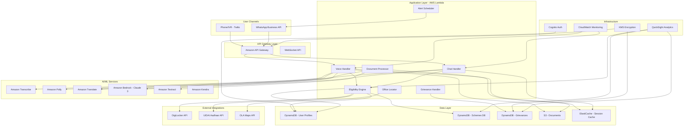

# Design Document: JanSahayak AI

## Overview

JanSahayak AI is a serverless, voice-first, multilingual AI platform designed to connect rural Indian citizens with government welfare schemes. The system architecture prioritizes low-bandwidth operation, voice interaction, and multilingual support to serve users with low literacy on 2G networks.

The platform leverages AWS serverless services for scalability and cost-effectiveness, Amazon Bedrock for AI capabilities, and integrates with government APIs (DigiLocker, UIDAI) and third-party services (WhatsApp Business API, OLA Maps). The design emphasizes data security, DPDP Act 2023 compliance, and 24x7 availability.

## Architecture

### High-Level Architecture


```mermaid
graph TB
    subgraph "User Channels"
        A[Phone/IVR - Twilio]
        B[WhatsApp Business API]
    end
    
    subgraph "API Gateway Layer"
        C[Amazon API Gateway]
        D[WebSocket API]
    end
    
    subgraph "Application Layer - AWS Lambda"
        E[Voice Handler]
        F[Chat Handler]
        G[Eligibility Engine]
        H[Document Processor]
        I[Office Locator]
        J[Grievance Handler]
        K[Alert Scheduler]
    end
    
    subgraph "AI/ML Services"
        L[Amazon Transcribe]
        M[Amazon Polly]
        N[Amazon Translate]
        O[Amazon Bedrock - Claude 3]
        P[Amazon Textract]
        Q[Amazon Kendra]
    end
    
    subgraph "Data Layer"
        R[DynamoDB - User Profiles]
        S[DynamoDB - Schemes DB]
        T[DynamoDB - Grievances]
        U[S3 - Documents]
        V[ElastiCache - Session Cache]
    end
    
    subgraph "External Integrations"
        W[DigiLocker API]
        X[UIDAI Aadhaar API]
        Y[OLA Maps API]
    end
    
    subgraph "Infrastructure"
        Z[CloudWatch Monitoring]
        AA[KMS Encryption]
        AB[Cognito Auth]
        AC[QuickSight Analytics]
    end
    
    A --> C
    B --> C
    C --> E
    C --> F
    E --> L
    E --> M
    F --> N
    E --> O
    F --> O
    E --> G
    F --> G
    G --> S
    G --> R
    H --> P
    H --> N
    I --> Y
    J --> T
    K --> B
    E --> V
    F --> V
    G --> W
    G --> X
    E --> U
    H --> U
    Z --> E
    Z --> F
    AA --> R
    AA --> T
    AB --> C
    AC --> R
    AC --> S
    AC --> T
```

### Architecture Principles

1. **Serverless-First**: All compute runs on AWS Lambda for automatic scaling and cost optimization
2. **Voice-First Design**: Primary interaction mode is voice with text as fallback
3. **Low-Bandwidth Optimization**: All responses compressed and optimized for 2G networks (< 50KB)
4. **Multilingual by Default**: All components support 22 Indian languages
5. **Security and Privacy**: End-to-end encryption, DPDP Act 2023 compliance, minimal data retention
6. **Resilience**: Multi-AZ deployment, automatic failover, graceful degradation
7. **Stateless Services**: Session state in ElastiCache, enabling horizontal scaling

## Components and Interfaces

### 1. Voice Handler (AWS Lambda)

**Purpose**: Processes incoming voice calls via Twilio IVR, orchestrates speech-to-text, AI processing, and text-to-speech.

**Interfaces**:
- **Input**: Twilio webhook with audio stream URL, caller phone number, language preference
- **Output**: TwiML response with audio URL for playback

**Key Functions**:
```typescript
interface VoiceHandler {
  handleIncomingCall(request: TwilioWebhookRequest): Promise<TwiMLResponse>
  processAudioStream(audioUrl: string, language: string): Promise<TranscriptionResult>
  generateVoiceResponse(text: string, language: string): Promise<AudioUrl>
  manageCallState(sessionId: string, state: CallState): Promise<void>
}

interface TwilioWebhookRequest {
  CallSid: string
  From: string
  To: string
  CallStatus: string
  RecordingUrl?: string
  SpeechResult?: string
}

interface TranscriptionResult {
  text: string
  confidence: number
  language: string
  intent: string
}

interface CallState {
  sessionId: string
  userId: string
  currentStep: string
  context: Record<string, any>
  language: string
}
```

**Processing Flow**:
1. Receive Twilio webhook
2. Retrieve or create session from ElastiCache
3. Send audio to Amazon Transcribe for speech-to-text
4. Translate to English if needed (Amazon Translate)
5. Send to AI orchestrator for intent recognition and response generation
6. Translate response back to user's language
7. Convert to speech using Amazon Polly
8. Store audio in S3 with 1-hour expiry
9. Return TwiML with audio URL
10. Update session state in ElastiCache

**Optimization for 2G**:
- Audio compression: Opus codec at 16kbps
- Response chunking: Max 30-second segments
- Adaptive quality: Reduce bitrate if network latency > 3s

### 2. Chat Handler (AWS Lambda)

**Purpose**: Processes WhatsApp messages, handles text and voice notes, manages conversation flow.

**Interfaces**:
- **Input**: WhatsApp Business API webhook with message content
- **Output**: WhatsApp message (text, voice note, or interactive buttons)

**Key Functions**:
```typescript
interface ChatHandler {
  handleIncomingMessage(request: WhatsAppWebhook): Promise<WhatsAppResponse>
  processTextMessage(text: string, userId: string, language: string): Promise<string>
  processVoiceNote(audioUrl: string, userId: string, language: string): Promise<string>
  sendTextResponse(userId: string, text: string): Promise<void>
  sendVoiceNote(userId: string, audioUrl: string): Promise<void>
  sendInteractiveButtons(userId: string, message: string, buttons: Button[]): Promise<void>
}

interface WhatsAppWebhook {
  from: string
  id: string
  timestamp: string
  type: 'text' | 'audio' | 'image' | 'button'
  text?: { body: string }
  audio?: { id: string, mime_type: string }
  image?: { id: string, mime_type: string }
  button?: { text: string, payload: string }
}

interface WhatsAppResponse {
  messaging_product: 'whatsapp'
  to: string
  type: 'text' | 'audio' | 'interactive'
  text?: { body: string }
  audio?: { link: string }
  interactive?: InteractiveMessage
}

interface Button {
  id: string
  title: string
}
```

**Processing Flow**:
1. Receive WhatsApp webhook
2. Authenticate user via phone number
3. Retrieve session from ElastiCache
4. Process message based on type (text/audio/image)
5. For voice notes: transcribe using Amazon Transcribe
6. For images: process with Document Processor
7. Send to AI orchestrator for response
8. Format response for WhatsApp (text or voice note)
9. Send via WhatsApp Business API
10. Update session state

### 3. Eligibility Engine (AWS Lambda)

**Purpose**: Matches user profiles against government scheme eligibility criteria using AI-powered analysis.

**Interfaces**:
- **Input**: User profile data (demographics, income, occupation, family details)
- **Output**: Ranked list of eligible schemes with match scores

**Key Functions**:
```typescript
interface EligibilityEngine {
  matchSchemes(profile: UserProfile): Promise<SchemeMatch[]>
  extractProfileFromVoice(transcript: string): Promise<UserProfile>
  rankSchemes(matches: SchemeMatch[]): SchemeMatch[]
  explainEligibility(scheme: Scheme, profile: UserProfile, language: string): Promise<string>
  checkDocumentRequirements(scheme: Scheme, profile: UserProfile): Promise<DocumentRequirement[]>
}

interface UserProfile {
  userId: string
  aadhaarNumber?: string // encrypted
  name: string
  age: number
  gender: 'male' | 'female' | 'other'
  occupation: string
  annualIncome: number
  landOwnership: number // in acres
  familySize: number
  familyMembers: FamilyMember[]
  state: string
  district: string
  village: string
  category: 'general' | 'obc' | 'sc' | 'st'
  disabilities?: string[]
}

interface FamilyMember {
  name: string
  age: number
  gender: string
  relation: string
  occupation?: string
}

interface Scheme {
  schemeId: string
  name: string
  nameTranslations: Record<string, string>
  description: string
  descriptionTranslations: Record<string, string>
  eligibilityCriteria: EligibilityCriteria
  benefits: string
  applicationProcess: ApplicationStep[]
  requiredDocuments: string[]
  deadline?: Date
  state?: string
  category: 'agriculture' | 'health' | 'housing' | 'employment' | 'education' | 'pension'
}

interface EligibilityCriteria {
  minAge?: number
  maxAge?: number
  gender?: string[]
  occupation?: string[]
  maxIncome?: number
  minLandOwnership?: number
  maxLandOwnership?: number
  category?: string[]
  state?: string[]
  customRules?: string
}

interface SchemeMatch {
  scheme: Scheme
  matchScore: number // 0-100
  eligibilityStatus: 'eligible' | 'partially_eligible' | 'not_eligible'
  missingCriteria: string[]
  explanation: string
}

interface ApplicationStep {
  stepNumber: number
  description: string
  descriptionTranslations: Record<string, string>
  requiredDocuments: string[]
  officeType: string
  formNumber?: string
}

interface DocumentRequirement {
  documentName: string
  availableInDigiLocker: boolean
  alternativeSource: string
  mandatory: boolean
}
```

**Matching Algorithm**:
1. Load all active schemes from DynamoDB
2. Filter schemes by basic criteria (age, gender, state)
3. For each remaining scheme, calculate match score using Amazon Bedrock
4. Identify missing criteria
5. Rank schemes by match score and benefit amount
6. Generate natural language explanations in user's language
7. Return top 10 matches

### 4. Document Processor (AWS Lambda)

**Purpose**: Extracts text from government documents using OCR, translates content, and provides simplified explanations.

**Processing Flow**:
1. Validate image quality
2. Send image to Amazon Textract for OCR
3. Detect language using Amazon Comprehend
4. Extract structured data using pattern matching and AI
5. Identify document type using Claude 3
6. Extract key information (dates, amounts, reference numbers)
7. Translate to user's language using Amazon Translate
8. Generate simplified explanation using Claude 3
9. Identify action items and deadlines
10. Return analysis to user

### 5. Office Locator (AWS Lambda)

**Purpose**: Finds nearest government offices using GPS coordinates or location name, provides directions.

**Processing Flow**:
1. Geocode location name using OLA Maps API if needed
2. Query DynamoDB for offices within 50km radius
3. Calculate distances using Haversine formula
4. Sort by distance and fetch top 5 office details
5. Generate voice-friendly directions
6. Translate to user's language
7. Return ranked list

### 6. Grievance Handler (AWS Lambda)

**Purpose**: Guides users through filing grievances (RTI, MNREGA disputes), generates formatted documents, tracks status.

**Guided Flow for MNREGA Wage Dispute**:
1. Confirm user worked under MNREGA
2. Collect work period and expected wage
3. Collect job card number and work site
4. Record voice description of issue
5. Collect supporting documents
6. Generate formatted complaint
7. Submit and return reference number via WhatsApp

### 7. Alert Scheduler (AWS Lambda + EventBridge)

**Purpose**: Sends proactive WhatsApp alerts for scheme deadlines, new schemes, and application reminders.

**Alert Scheduling Logic**:
1. EventBridge triggers daily at 6 AM IST
2. Query schemes with deadlines in next 7 days
3. For each scheme, identify eligible users
4. Check opt-out status and existing alerts
5. Batch alerts by language and send via WhatsApp
6. Update alert status and handle failures with retry

### 8. AI Orchestrator (Amazon Bedrock - Claude 3 Sonnet)

**Purpose**: Central AI engine for intent recognition, conversation management, response generation, and complex reasoning.

**Key Capabilities**:
- Intent classification from voice/text input
- Multi-turn conversation management
- Scheme eligibility reasoning
- Document interpretation
- Natural language generation in 22 languages via translation

### 9. Authentication Service (Amazon Cognito)

**Purpose**: Authenticates users via phone OTP, manages sessions, integrates with Aadhaar verification.

**Authentication Flow**:
1. User provides phone number
2. Generate and send 6-digit OTP via AWS SNS
3. Store OTP hash in ElastiCache (5-minute expiry)
4. Verify OTP and create user record in DynamoDB
5. Generate JWT token using Cognito
6. Return token with 15-minute session expiry

## Data Models

### User Profile (DynamoDB)
```
PK: USER#{userId}
SK: PROFILE
Fields: userId, phoneNumber, aadhaarNumber (encrypted), name, age, gender,
        occupation, annualIncome, landOwnership, familyMembers, address,
        state, district, village, category, preferredLanguage, alertsEnabled
```

### Scheme Database (DynamoDB)
```
PK: SCHEME#{schemeId}
SK: METADATA
Fields: schemeId, name, nameTranslations, description, eligibilityCriteria,
        benefits, benefitAmount, applicationProcess, requiredDocuments,
        deadline, isActive, category, level (central/state)
```

### Conversation Session (ElastiCache)
```
Fields: sessionId, userId, channel, language, conversationHistory,
        currentIntent, context, ttl (15 minutes)
```

### Grievance Record (DynamoDB)
```
PK: GRIEVANCE#{referenceNumber}
SK: DETAILS
Fields: referenceNumber, userId, grievanceType, issueDescription,
        affectedScheme, status, submittedAt, resolution
```

### Alert Record (DynamoDB)
```
PK: ALERT#{alertId}
SK: DETAILS
Fields: alertId, userId, schemeId, alertType, scheduledFor,
        sentAt, status, message, language
```

### Application Tracking (DynamoDB)
```
PK: USER#{userId}
SK: APPLICATION#{schemeId}#{timestamp}
Fields: userId, schemeId, applicationStatus, startedAt,
        completedSteps, collectedDocuments, lastUpdated
```

## Security and Compliance

- All Aadhaar numbers encrypted using AWS KMS
- End-to-end TLS/SSL encryption for all communications
- DPDP Act 2023 compliant data handling
- Minimal data retention policy
- Amazon Cognito for admin authentication
- IAM roles with least-privilege access
- CloudWatch for monitoring and audit logging
- Multi-AZ deployment for high availability
